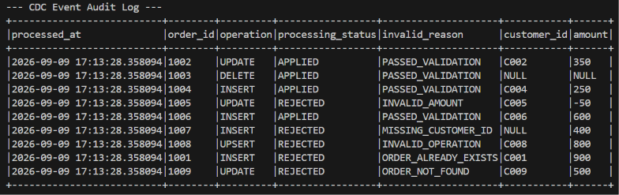
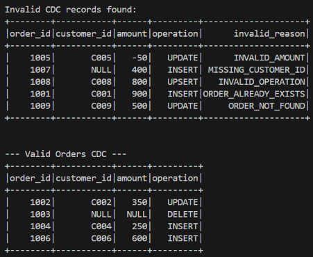

# PySpark CDC Audit & Data Lineage Pipeline

## Project Overview

A PySpark batch pipeline that validates Change Data Capture (CDC) events,
creates an audit log for every incoming event, quarantines invalid records,
and reconstructs the latest orders dataset.

The pipeline reads historical orders from `data/orders_existing.csv` and
incoming CDC events from `data/orders_cdc.csv`. It validates operation types,
required fields, amount values, and references to existing orders.

Valid events are applied to the existing dataset. Invalid events are written
to `output/rejected_orders/`, while the final orders state is written to
`output/latest_orders/`. An audit log containing processing status,
validation reasons, and processing timestamps is appended to
`output/audit_log/`.

---

## Technologies

- Python 3.14
- Apache Spark 4.2
- PySpark 4.2

---

## Features

- **Granular Validation Reason Tagging:** Evaluates multiple validation
  rules using chained `when()` conditions and assigns rejection reasons
  such as `INVALID_OPERATION`, `INVALID_AMOUNT`, `ORDER_NOT_FOUND`, and
  `ORDER_ALREADY_EXISTS`.

- **Distributed Key Validation:** Uses a left join against existing order
  keys to validate INSERT, UPDATE, and DELETE references without collecting
  all keys into a Python list.

- **CDC Audit Logging:** Records each CDC event with its order ID,
  operation, processing status, validation result, and processing timestamp.

- **Rejected Record Quarantine:** Separates invalid CDC events from valid
  events and writes rejected records to `output/rejected_orders/`.

- **CDC State Reconstruction:** Removes affected historical records using
  `left_anti` joins and combines valid INSERT and UPDATE events with
  unchanged records using `unionByName()`.

- **Multi-Destination Parquet Output:** Writes the final orders dataset,
  rejected records, and audit records to separate Parquet output paths.

---

## Project Structure

```text
35-pyspark-cdc-audit-data-lineage-pipeline/
├── data/
│   ├── orders_cdc.csv
│   └── orders_existing.csv
├── output/
│   ├── audit_log/
│   ├── latest_orders/
│   └── rejected_orders/
├── screenshots/
│   ├── output1.png
│   ├── output2.png
│   ├── output3.png
│   ├── output4.png
│   └── output5.png
├── src/
│   └── main.py
├── .gitignore
├── LICENSE
├── README.md
└── requirements.txt
```

---

## ETL Process

### Extract & Inspect

- Initializes a local SparkSession using `local[*]` execution.

- Ingests target historical data (data/orders_existing.csv) and operational CDC streams (data/orders_cdc.csv).

- Displays sample rows and schemas for the existing and CDC datasets.

### Transform (Validation, Audit Tagging, & State Reconciliation)

- Existing-Key Validation: Joins CDC records with existing order keys to determine whether each referenced order already exists.

- Conditional Reason Tagging: Evaluates chained when() rules to tag explicit failure codes in invalid_reason.

- Audit Log Generation: Appends pipeline execution metadata (processing_status, invalid_reason, processed_at) using current_timestamp().

- Data Stream Partitioning: Separates quarantined records (invalid_orders_cdc_df) from valid mutation events (valid_orders_cdc_df).

- State Reconstruction: Prunes updated and deleted keys from historical records via left_anti joins, merges active inserts and updates using unionByName(), and orders output by order_id ASC.

### Load & Export

- Writes the finalized current state to output/latest_orders/ in Parquet format (overwrite).

- Writes quarantined invalid CDC events to output/rejected_orders/ in Parquet format (overwrite).

- Appends execution audit trails to output/audit_log/ in Parquet format (append).

---

## Sample Output





---

## What I Learned

- Separating invalid CDC records from valid records without stopping the
  entire batch.

- Assigning specific validation reasons to rejected records.

- Using distributed PySpark joins instead of collecting existing keys into
  Python lists.

- Creating an audit log that records processing status, validation reasons,
  and processing timestamps for every CDC event.

- Reconstructing the latest orders state from unchanged records and valid
  CDC changes.

- Writing target data, rejected records, and audit logs to separate Parquet
  destinations using different save modes.

--- 

## Future Improvements

- Delta Lake Storage: Use Delta Lake to support ACID transactions, versioned table history, and time-travel queries.

- Event Sourcing & Micro-Batch Processing: Adapt the architecture to process streaming change logs continuously via PySpark Structured Streaming.

- Rejected Record Replay: Build a utility that reads corrected records from `output/rejected_orders/`, validates them again, and reprocesses records that pass validation.

- Data Catalog Integration: Export lineage metadata to data governance platforms (such as Apache Atlas or OpenLineage).

- Batch Tracking: Add a `batch_id` or `run_id` column so audit records can be associated with a specific pipeline execution.

---

## Skills Demonstrated

- **Data Quality:** Null validation, amount validation, operation
  validation, and business-key validation.

- **CDC Processing:** Handling INSERT, UPDATE, and DELETE events.

- **Audit Logging:** Recording processing status, validation reasons,
  original event values, and processing timestamps.

- **PySpark DataFrame API:** Left joins, `left_anti`, `filter()`,
  `isin()`, `isNull()`, `when()`, `otherwise()`, and `unionByName()`.

- **Pipeline Monitoring:** Reporting valid, rejected, and final record counts.

- **Data Storage:** Writing processed data and audit records to Parquet
  using overwrite and append modes.